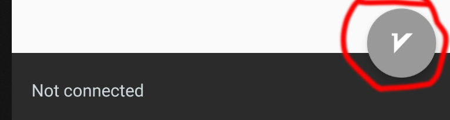
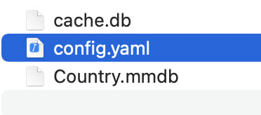

* [V2RayNG for Android](/#v2rayng-for-android). 
* [Shadowrocket for iOS](/#shadowrocket-for-ios). 
* [V2RayN for Windows](/#v2rayn-for-windows). 
* [ClashX for Mac](/#clashx-for-mac). 
* [V2Ray for Linux](/#v2ray-for-linux). 


This page is a documentation for how to use **V2Ray** VPN applications for Android, iOS, Desktop and Linux server, such as **V2RayNG** for Android Moibles, **Shadowrocket** for iOS, **V2RayN** for Windows, ClashX for MacBook and etc.


# Introduction

V2Ray may be the most advanced VPN technology, by cooperating with other tools, V2Ray can demonstrate different website access methods, so as to avoid detection and illustrate proxy access to the network. for example, use websocket and TLS to obfuscate network data to make it impossible to detect or consume a lot of detection resources, making detection more than worth the cost.  


  
## V2RayNG for Android

| Download From Source |
|:--------|:----------|:----------|
| [Google Play](https://play.google.com/store/apps/details?id=com.v2ray.ang)  | [Github](https://github.com/2dust/v2rayNG/releases/download/1.7.16/v2rayNG_1.7.16_x86_64.apk) | [APKPure](https://apkpure.com/v2rayng/com.v2ray.ang)  |

<dl>
  <dt>Import config from QRcode.</dt>
  <dd>1: click + on the top right of V2RayNG</dd>
  <dd>2: click "Import config from QRcode"</dd>
  <dd>3: scan a QRcode which you get from a VPN provider.</dd>
  <dd>4: click the logo on the bottom left of V2RayNG and make the connection to work.</dd>
</dl>


<dl>
  <dt>Import config from Clipboard.</dt>
  <dd>1. copy a VMess link which you get from a vpn provider.</dd>
  <dd>2. click + on the top left of V2RayNG.</dd>
  <dd>3. click "Import config from Clipboard".</dd>
  <dd>4. click the logo on the bottom left of V2RayNG and make the connection to work.</dd>
</dl>  

```js
// an example a V2RayNG format VMess url.
vmess://eyJhZGQiOiIxMDBtanAxMDAwMy53ZXJzZC54eXoiLCJhaWQiOiIyMzMiLCJob3N0IjoiMTAwbWpwMTAwMDMud2Vyc2QueHl6IiwiaWQiOiI2MGExN2NiOS0wODVjLTRkYTgtYTAzNS1jZDkyZmI4MzdmMTciLCJuZXQiOiJ3cyIsInBhdGgiOiJyMiIsInBvcnQiOiI0NDMiLCJwcyI6IlYyUkFZUSIsInNjeSI6ImNoYWNoYTIwLXBvbHkxMzA1Iiwic25pIjoiMTAwbWpwMTAwMDMud2Vyc2QueHl6IiwidGxzIjoidGxzIiwidHlwZSI6IiIsInYiOiIyIn0=
```

 

 

 

 

 

 

 

 

* * *
 

## Shadowrocket for iOS

Download Shadowrocket from [Appstore](https://apps.apple.com/us/app/shadowrocket/id932747118)

<dl>
  <dt>Import config from QRcode.</dt>
  <dd>1. click scan icon on the top left of Shadowrocket.</dd>
  <dd>2. allow the Shadowrocket has the camera permission.</dd>
  <dd>4. scan and import and then allow Shadowrocket has VPN permission.</dd>
  <dd>5. click the enable button.</dd>
</dl> 

<dl>
  <dt>Import config from Clipboard.</dt>
  <dd>1. copy a VMess url which your vpn provider given.</dd>
  <dd>2. open Shadowrocket application.</dd>
  <dd>4. add copied config to your list.</dd>
  <dd>5. click the enable button.</dd>
</dl> 

```js
// an example a Shadowrocket format VMess url.
vmess://Y2hhY2hhMjAtcG9seTEzMDU6YjZiMGJmNWQtZWFjMS00NzM1LThiNDYtNmJlYTYwZTEwZmQwQDEwMGdoazEwMDAxLndlcnNkLnh5ejo0NDM=?remarks=R2VPN&obfsParam=%7B%22Host%22:%22100ghk10101.wgwsd.xyz%22%7D&path=/r2&obfs=websocket&tls=1&peer=100ghk10101.wgwsd.xyz&mux=1&alterId=233
```
 
 

 

 

 ***

## V2RayN for Windows

| Download From Source |
|:--------| 
| [Github](https://github.com/2dust/v2rayN/releases/download/5.29/v2rayN-Core.zip) |  

1. Download V2RayN from Github and unzip it.
2. Double click "v2rayN.exe", it will be open.
3. Click "Add VMess Server" or other kinds.
4. Input the server configurations and save.

 

 

 ***

## ClashX for Mac

| Download from Source|
|:--------|:----------|:----------|
| ClashX | [Github](https://github.com/yichengchen/clashX/releases/download/1.94.0/ClashX.dmg) |  ClashX Pro |  [App Center](https://install.appcenter.ms/users/clashx/apps/clashx-pro/distribution_groups/public)  |  

1. Double click ClashX.dmg and install it, and then open ClashX
2. Click ClashX icon on the tab bar, and navigate to "Config" -> "Open config folder".
3. Open "config.yaml" in an editor, set port and some proxy configurations.
4. Save and exit.
5. Change proxy mode to "Rule" or "Global", set proxy to what you just set in config.yaml.

  

 

 

  

 

 

  

  

 ***

## V2Ray for Linux

Download V2Ray from [Github](https://github.com/v2fly/v2ray-core/releases)

<dl>
<dt>execute below commnands one by one</dt>
</dl>

 ```ruby
  sudo mkdir -p /usr/bin/v2ray/
  sudo mkdir -p /etc/v2ray/
  sudo mkdir -p /var/log/v2ray/
  sudo mv v2ray v2ctl /usr/bin/v2ray/
  sudo mv config.json /etc/v2ray/
  sudo chmod +x /usr/bin/v2ray/*
  sudo mv v2ray.service '/etc/systemd/system/v2ray.service'
```

<dl>
<dt>replace config.json contents to below</dt>
</dl>

 ```json
{
    "log": {
        "loglevel": "warning",
        "access": "/var/log/v2ray/access.log",
        "error": "/var/log/v2ray/error.log"
    },
    "inbounds": [
        {
            "port": "9001",
            "listen": "127.0.0.1",
            "protocol": "vmess",
            "settings": {
                "clients": [
                    {
                        "id": "75a4f17c-d013-4d67-8a1d-2860158ea8e4",
                        "alterId": 233
                    } 
                ]
            },
            "streamSettings": {
                "network": "ws",
                "wsSettings": {
                    "path": "/r2"
                }
            }
        } 
    ],
    "outbounds": [
        {
            "protocol": "freedom",
            "settings": { }
        }
    ]
}
```
 
 <dl>
<dt>set your proxy inbound port to 9001, and password to 75a4f17c-d013-4d67-8a1d-2860158ea8e4.</dt>
</dl>

