* [V2RayNG for Android](#v2rayng-for-android). 
* [Shadowrocket for iOS](#shadowrocket-for-ios). 
* [QuantumultX for iOS](#quantumultx-for-ios). 
* [V2RayN for Windows](#v2rayn-for-windows). 
* [ClashX for Mac](#clashx-for-mac). 
* [V2Ray for Linux](#v2ray-for-linux).  


# Introduction

V2Ray 可能是当前最先进的VPN技术，通过与其他工具的配合，V2Ray可以实现不同的网站访问方式，从而避免被监控并实现代理访问网络。 例如，使用Websocket和TLS的组合方式访问网络并对数据混淆处理，使监控无法检测或消耗大量监控资源，让得不偿失。

  
## V2RayNG for Android

| 从源站下载 |
|:--------|:----------|:----------|
| [Google Play](https://play.google.com/store/apps/details?id=com.v2ray.ang)  | [Github](https://github.com/2dust/v2rayNG/releases/download/1.7.16/v2rayNG_1.7.16_x86_64.apk) | [APKPure](https://apkpure.com/v2rayng/com.v2ray.ang)  |

<dl>
  <dt>扫描二维码.</dt>
  <dd>1: 点击右上角 + </dd>
  <dd>2: 点击 扫描二维码</dd>
  <dd>3: 开始扫描二维码.</dd>
  <dd>4: 点击底部右下角LOGO使VPN启用.</dd>
</dl>


<dl>
  <dt>从剪贴板导入.</dt>
  <dd>1. 复制VMess链接到剪贴板.</dd>
  <dd>2. 点击右上角 +.</dd>
  <dd>3. 点击 从剪贴板导入.</dd>
  <dd>4. 点击底部右下角LOGO使VPN启用.</dd>
</dl>  

```js
// an example a V2RayNG format VMess url.
vmess://eyJhZGQiOiIxMDBtanAxMDAwMy53ZXJzZC54eXoiLCJhaWQiOiIyMzMiLCJob3N0IjoiMTAwbWpwMTAwMDMud2Vyc2QueHl6IiwiaWQiOiI2MGExN2NiOS0wODVjLTRkYTgtYTAzNS1jZDkyZmI4MzdmMTciLCJuZXQiOiJ3cyIsInBhdGgiOiJyMiIsInBvcnQiOiI0NDMiLCJwcyI6IlYyUkFZUSIsInNjeSI6ImNoYWNoYTIwLXBvbHkxMzA1Iiwic25pIjoiMTAwbWpwMTAwMDMud2Vyc2QueHl6IiwidGxzIjoidGxzIiwidHlwZSI6IiIsInYiOiIyIn0=
```

 

 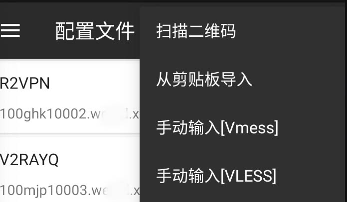

 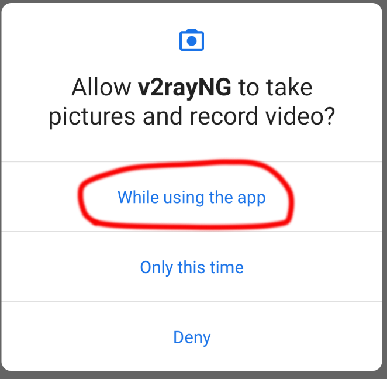

 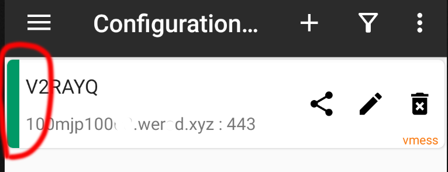

 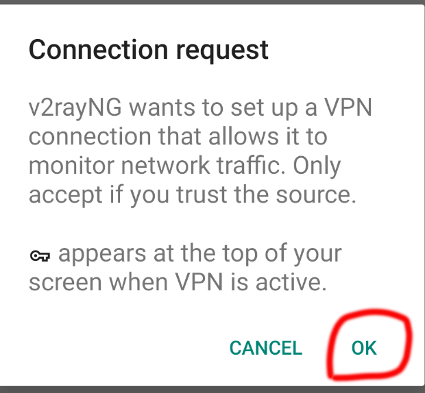

 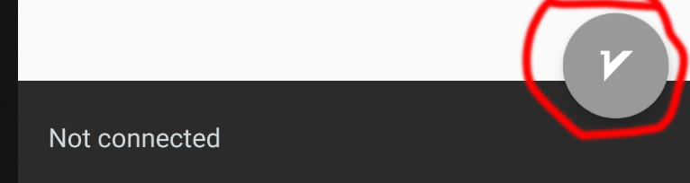

 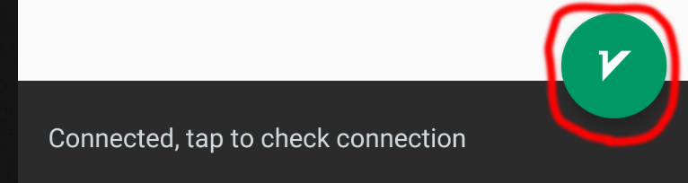

 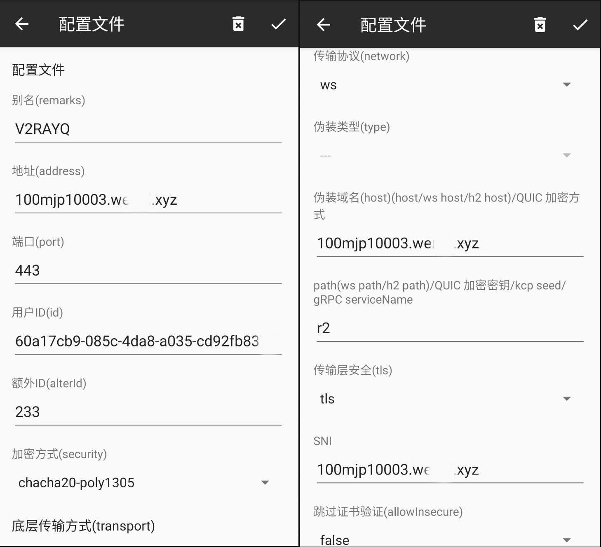

* * *
 

## Shadowrocket for iOS

下载 [Appstore](https://apps.apple.com/us/app/shadowrocket/id932747118)

<dl>
  <dt>扫描二维码.</dt>
  <dd>1. 点击左上角扫描图标.</dd>
  <dd>2. 允许shadowrocket相机使用权限.</dd>
  <dd>4. 允许shadowrocket VPN 权限.</dd>
  <dd>5. 点击开启VPN.</dd>
</dl> 

<dl>
  <dt>从剪贴板导入.</dt>
  <dd>1. 复制VMess链接到剪贴板.</dd>
  <dd>2. 打开shadowrocket.</dd>
  <dd>4. 添加VMess到列表.</dd>
  <dd>5. 点击开启VPN.</dd>
</dl> 

```js
// an example a Shadowrocket format VMess url.
vmess://Y2hhY2hhMjAtcG9seTEzMDU6YjZiMGJmNWQtZWFjMS00NzM1LThiNDYtNmJlYTYwZTEwZmQwQDEwMGdoazEwMDAxLndlcnNkLnh5ejo0NDM=?remarks=R2VPN&obfsParam=%7B%22Host%22:%22100ghk10101.wgwsd.xyz%22%7D&path=/r2&obfs=websocket&tls=1&peer=100ghk10101.wgwsd.xyz&mux=1&alterId=233
```
 
 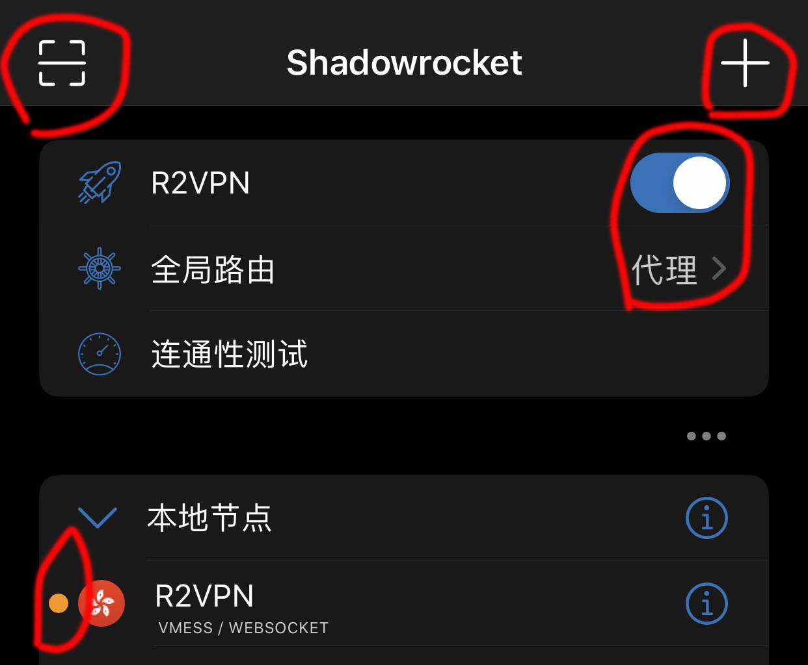

 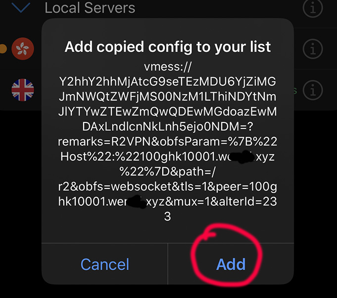

 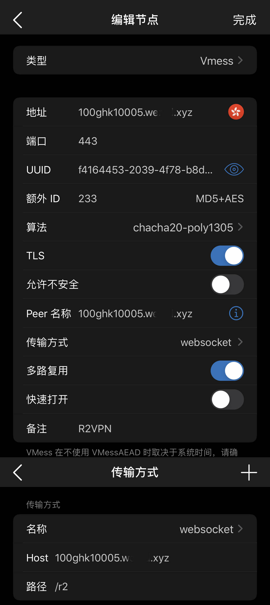

 ***


## QuantumultX for iOS

下载 Quantumult X 从 [Appstore](https://apps.apple.com/app/quantumult-x/id1443988620)

<dl>
  <dt>复制VMess链接到QuantumultX设置文件.</dt>
  <dd>1. 点击首页左下角QuantumultX的风车图标.</dd>
  <dd>2. 点击设置页面右上角链接图标.</dd>
  <dd>4. 点击设置文件右上角第二个图标.</dd>
  <dd>5. 点击 [server_local] 滑到 182 行， 把QuantumultX VMess URI 复制到此.</dd>
  <dd>5. 点击右上角保存回到首页点击启用此设置.</dd>
</dl> 


```php
// an example a QuantumultX format VMess url.
vmess=100ghk10001.wewd.xyz:443, method=chacha20-poly1305, password=ab0afc33-4df5-44a8-ac27-e96c888514a8, obfs=wss, obfs-host=100ghk10001.werwe.xyz, obfs-uri=/r2, tls13=true, fast-open=false, udp-relay=false, tag=R2VPN
```
 
 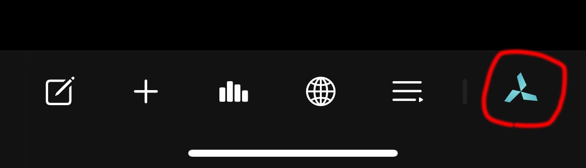

 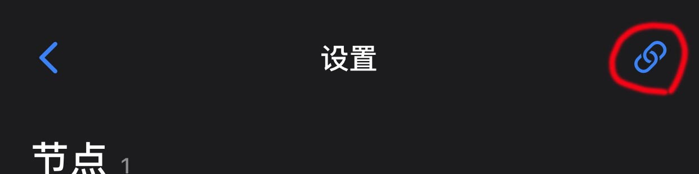

 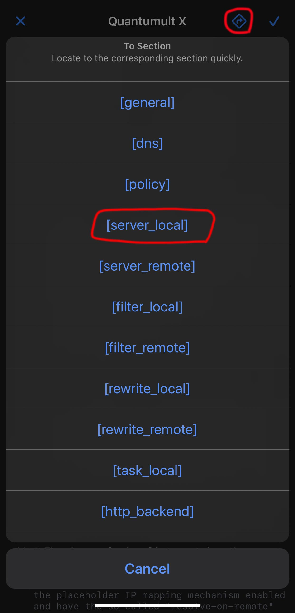

 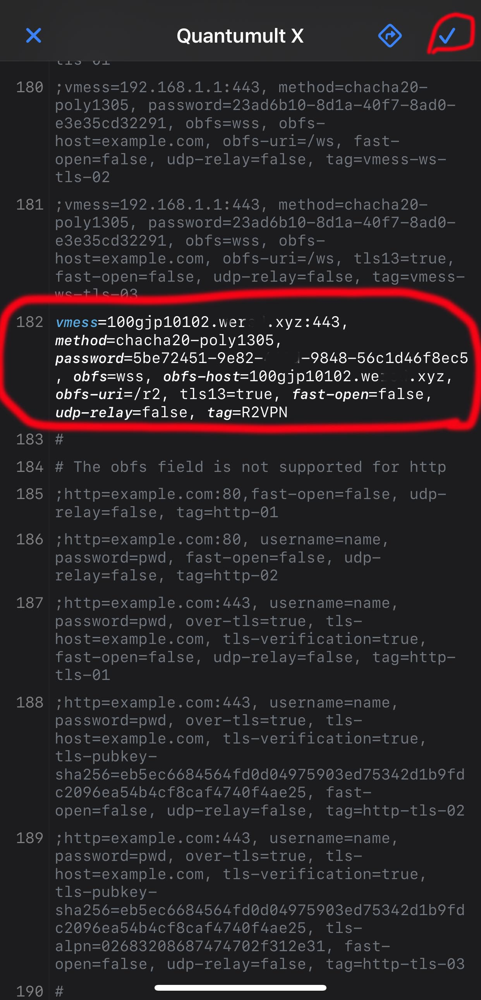

 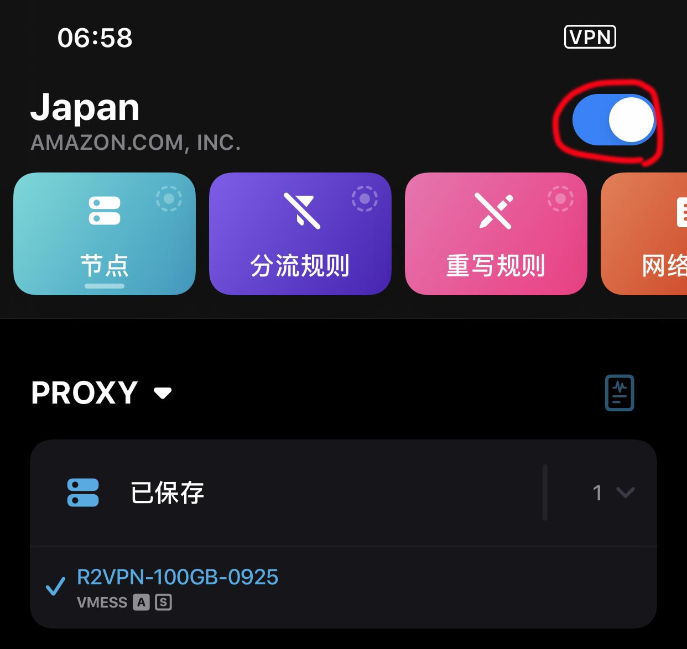

 ***


## V2RayN for Windows

| 从源站下载 |
|:--------| 
| [Github](https://github.com/2dust/v2rayN/releases/download/5.29/v2rayN-Core.zip) |  

1. 下载V2RayN并解压.
2. 双击"v2rayN.exe"打开.
3. 点击添加VMess或其他方式.
4. 输入服务器信息保存.

 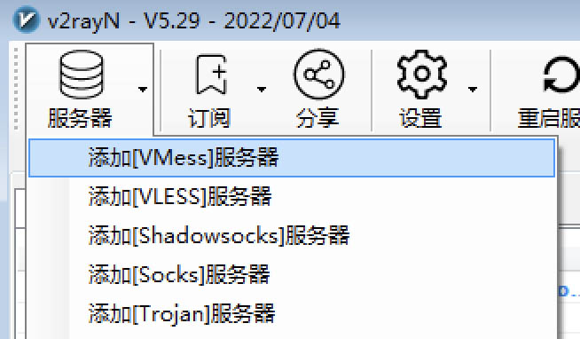

 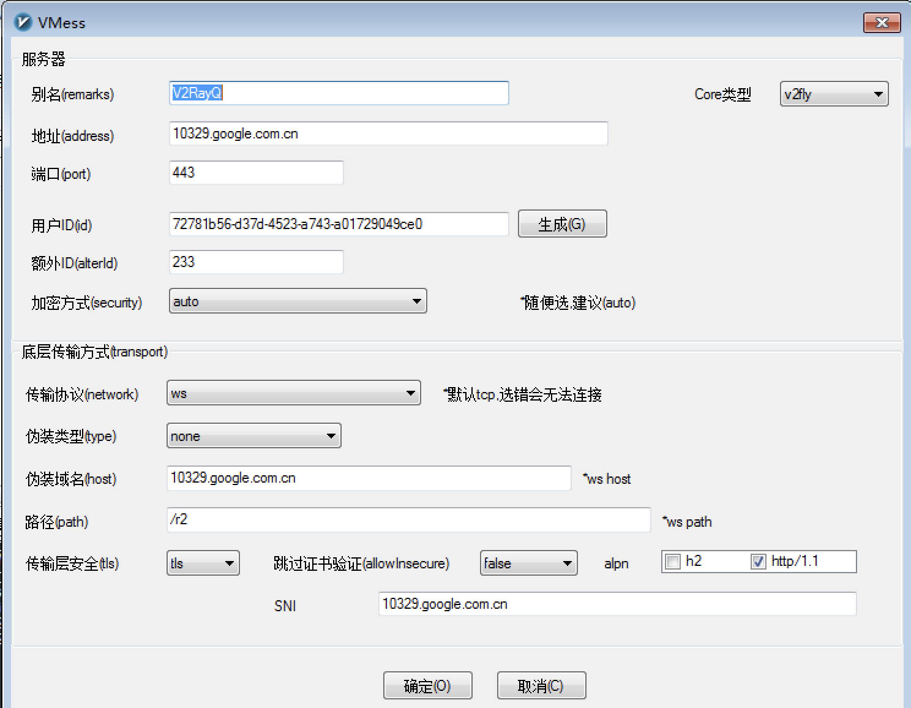

 ***

## ClashX for Mac

| 从源站下载|
|:--------|:----------|:----------|
| ClashX | [Github](https://github.com/yichengchen/clashX/releases/download/1.94.0/ClashX.dmg) |  ClashX Pro |  [App Center](https://install.appcenter.ms/users/clashx/apps/clashx-pro/distribution_groups/public)  |  

1. 双击 ClashX.dmg 安装，并打开 ClashX
2. 在顶部点击 Clashx, 依次至 "设置" -> "打开设置文件目录".
3. 在编辑器打开 "config.yaml" 填写端口等信息.
4. 保存退出.
5. 变更代理至 "条件" or "全局", 设置代理为刚才在 config.yaml的方式.

 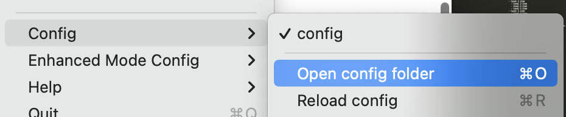 

 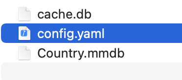

 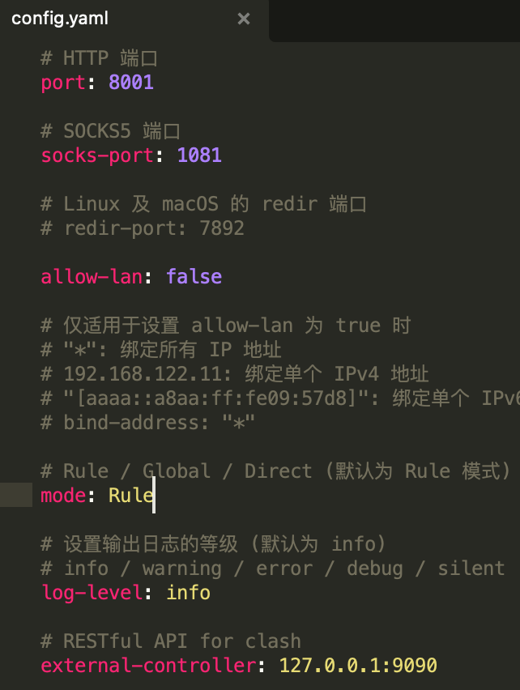

 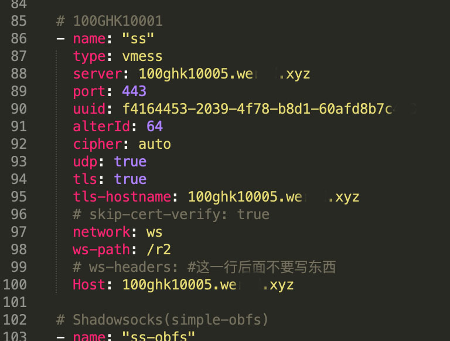 

 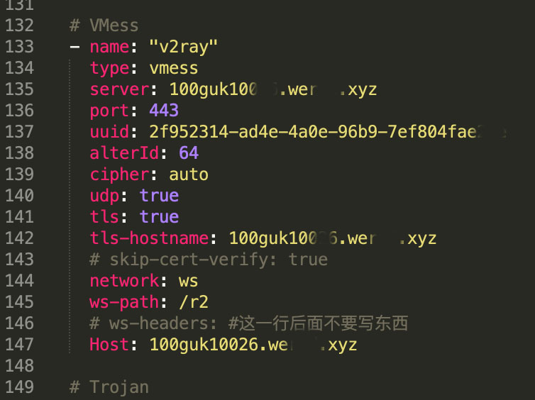

 

 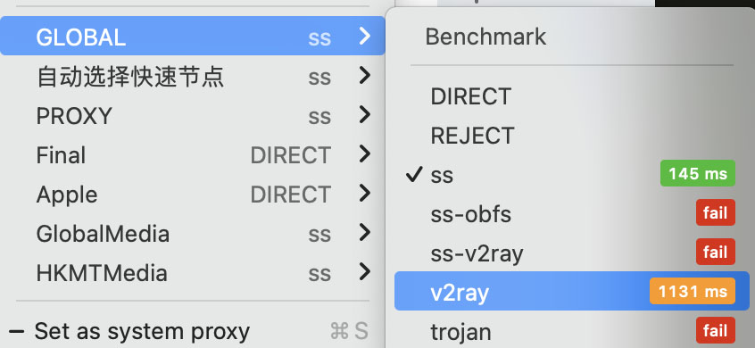 

 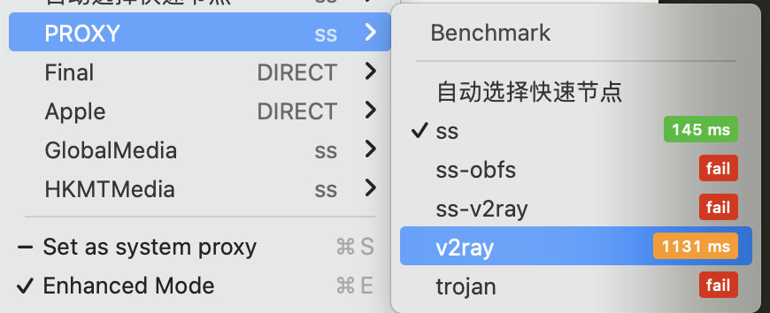 

 ***

## V2Ray for Linux

从源站下载 [Github](https://github.com/v2fly/v2ray-core/releases)

<dl>
<dt>一行一行执行以下命令</dt>
</dl>

 ```ruby
  sudo mkdir -p /usr/bin/v2ray/
  sudo mkdir -p /etc/v2ray/
  sudo mkdir -p /var/log/v2ray/
  sudo mv v2ray v2ctl /usr/bin/v2ray/
  sudo mv config.json /etc/v2ray/
  sudo chmod +x /usr/bin/v2ray/*
  sudo mv v2ray.service '/etc/systemd/system/v2ray.service'
```

<dl>
<dt>替换config.json至以下内容</dt>
</dl>

 ```json
{
    "log": {
        "loglevel": "warning",
        "access": "/var/log/v2ray/access.log",
        "error": "/var/log/v2ray/error.log"
    },
    "inbounds": [
        {
            "port": "9001",
            "listen": "127.0.0.1",
            "protocol": "vmess",
            "settings": {
                "clients": [
                    {
                        "id": "75a4f17c-d013-4d67-8a1d-2860158ea8e4",
                        "alterId": 233
                    } 
                ]
            },
            "streamSettings": {
                "network": "ws",
                "wsSettings": {
                    "path": "/r2"
                }
            }
        } 
    ],
    "outbounds": [
        {
            "protocol": "freedom",
            "settings": { }
        }
    ]
}
```
 
 <dl>
<dt>使用时候设置端口 9001, 密码为75a4f17c-d013-4d67-8a1d-2860158ea8e4.</dt>
</dl>

